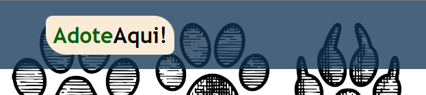

# 🐾 Adote Aqui 🐕‍🦺

🚼 Meus primeiros passos com HTML e CSS

---

## 🧪 Experienciando

📈 Criar uma página simples, com header e footer.

📉 Praticar Flexbox.

📈 Usar seletores CSS (:hover).

📉 Praticar Responsividade.

---

## 🌱Desenvolvido por

<b>Leonardo de Almeida Chaves 💻</b>

